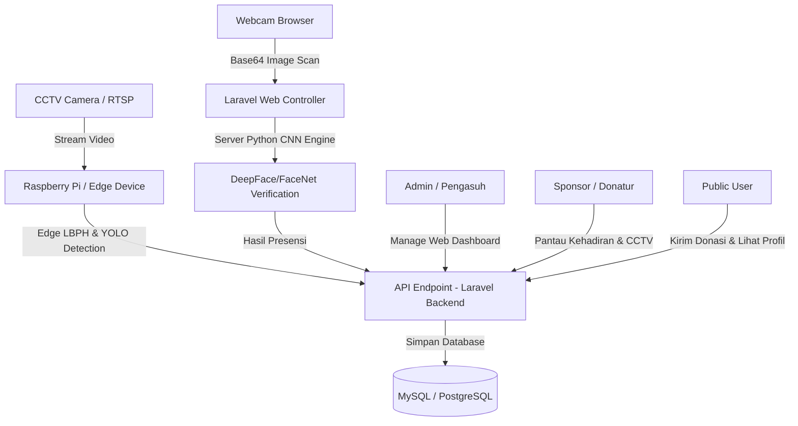

# SOFTWARE REQUIREMENTS SPECIFICATION (SRS)
## SPESIFIKASI KEBUTUHAN PERANGKAT LUNAK (SKPL)

**Proyek:** Sistem Informasi & Manajemen Presensi Berbasis Face Recognition Panti Asuhan Kasih Agape  
**Versi:** 1.0  
**Tanggal:** 19 Mei 2026  
**Status:** Dokumen Final (Berdasarkan Implementasi Codebase Aktif)  

---

## DAFTAR ISI
1. [PENDAHULUAN](#1-pendahuluan)
   - 1.1 Latar Belakang
   - 1.2 Tujuan Dokumen
   - 1.3 Ruang Lingkup Sistem
   - 1.4 Definisi, Akronim, dan Singkatan
2. [DESKRIPSI UMUM SISTEM](#2-deskripsi-umum-sistem)
   - 2.1 Arsitektur & Perspektif Produk (Hybrid Cloud-Edge)
   - 2.2 Fungsi Utama Perangkat Lunak
   - 2.3 Karakteristik & Hak Akses Pengguna (Role Matrix)
   - 2.4 Batasan-Batasan Sistem
3. [KEBUTUHAN ANTARMUKA EKSTERNAL](#3-kebutuhan-antarmuka-eksternal)
   - 3.1 Antarmuka Pengguna (User Interface)
   - 3.2 Antarmuka Perangkat Keras (Hardware Interface)
   - 3.3 Antarmuka Perangkat Lunak (Software Interface)
   - 3.4 Antarmuka Komunikasi (Communication Interface)
4. [KEBUTUHAN FUNGSIONAL SISTEM (SYSTEM FEATURES)](#4-kebutuhan-fungsional-sistem-system-features)
   - 4.1 Modul Publik (Landing Page & Donasi)
   - 4.2 Modul Manajemen Anak Asuh (Children Management)
   - 4.3 Modul Presensi Terpadu (Attendance Tracking)
   - 4.4 Modul Integrasi & Pemantauan CCTV
   - 4.5 Modul Engine Face Recognition (LBPH & CNN)
   - 4.6 Modul Manajemen Donasi & Verifikasi Admin
   - 4.7 Modul Manajemen Pengguna & Keamanan
   - 4.8 Modul Audit Trail (Activity Logs)
   - 4.9 Modul Sinkronisasi & CI/CD Auto-Deployment
5. [STRUKTUR DATABASE & MODEL DATA](#5-struktur-database--model-data)
   - 5.1 Tabel-Tabel Database
   - 5.2 Hubungan Antar Data (Relationships)
6. [KEBUTUHAN NON-FUNGSIONAL (NON-FUNCTIONAL REQUIREMENTS)](#6-kebutuhan-non-fungsional-non-functional-requirements)
   - 6.1 Performa & Efisiensi (Performance)
   - 6.2 Keamanan & Privasi (Security & Privacy)
   - 6.3 Keandalan & Ketersediaan (Reliability & Availability)
   - 6.4 Portabilitas (Portability)

---

## 1. PENDAHULUAN

### 1.1 Latar Belakang
Panti Asuhan Kasih Agape mengasuh sejumlah anak yang membutuhkan pengawasan, perawatan, dan transparansi manajemen yang baik. Selama ini, pencatatan data anak asuh, absensi harian, pemantauan CCTV, serta pencatatan donasi dari donatur masih dilakukan secara konvensional atau terpisah-pisah. 

Untuk meningkatkan efisiensi operasional dan memberikan rasa aman serta transparansi kepada para sponsor/donatur, dibangun sebuah platform sistem informasi berbasis web terintegrasi. Sistem ini menggunakan teknologi mutakhir kecerdasan buatan, yaitu **Face Recognition** (Pengenalan Wajah) berbasis **Convolutional Neural Network (CNN)** di server dan **Local Binary Patterns Histograms (LBPH)** di sisi perangkat keras kamera pintar (Raspberry Pi). Melalui sistem ini, presensi anak dapat dilakukan secara otomatis melalui kamera CCTV atau webcam, serta donatur dapat memantau kehadiran anak asuh dan aktivitas panti secara real-time.

### 1.2 Tujuan Dokumen
Dokumen Spesifikasi Kebutuhan Perangkat Lunak (SRS) ini dibuat untuk mendokumentasikan seluruh kebutuhan fungsional dan non-fungsional dari sistem informasi Panti Asuhan Kasih Agape. Dokumen ini berfungsi sebagai acuan resmi bagi pengembang, administrator sistem, pengurus panti, maupun pihak terafiliasi lainnya untuk memahami cara kerja sistem secara keseluruhan tanpa terkecuali.

### 1.3 Ruang Lingkup Sistem
Sistem yang dikembangkan meliputi:
1. **Portal Publik (Web Portal):** Menampilkan profil panti, galeri kegiatan, serta memfasilitasi donasi masyarakat umum secara online.
2. **Sistem Informasi Manajemen (Admin/Pengasuh Panel):** Mengelola database anak asuh, verifikasi donasi, audit log, manajemen pengguna, dan konfigurasi threshold kecocokan AI.
3. **Sistem Presensi & Log Deteksi Terpadu:** Mencatat kehadiran secara manual maupun otomatis dengan input dari pengenalan wajah.
4. **Sistem Edge Face Recognition & CCTV Tracker:** Mengintegrasikan stream CCTV lokal (RTSP/HLS) dengan modul deteksi aktivitas YOLO dan pengenalan wajah (Raspberry Pi & Server Engine).

### 1.4 Definisi, Akronim, dan Singkatan
*   **SRS / SKPL:** Software Requirements Specification / Spesifikasi Kebutuhan Perangkat Lunak.
*   **LBPH:** Local Binary Patterns Histograms (Algoritma ekstraksi wajah yang ringan, digunakan untuk komputasi lokal di Raspberry Pi).
*   **CNN:** Convolutional Neural Network (Arsitektur Deep Learning dengan akurasi tinggi untuk pengenalan wajah di server).
*   **RTSP:** Real-Time Streaming Protocol (Protokol transfer video CCTV).
*   **HLS:** HTTP Live Streaming (Protokol streaming video yang kompatibel dengan browser web modern).
*   **YOLO:** You Only Look Once (Algoritma pendeteksian objek real-time, digunakan untuk menghitung jumlah anak di area bersama).
*   **API:** Application Programming Interface.
*   **CI/CD:** Continuous Integration & Continuous Deployment.

---

## 2. DESKRIPSI UMUM SISTEM

### 2.1 Arsitektur & Perspektif Produk (Hybrid Cloud-Edge)
Sistem ini menggunakan arsitektur hybrid yang membagi beban kerja antara server web (Cloud/VPS) dan perangkat pintar di lapangan (Edge/Raspberry Pi):

1.  **Sistem Edge (Raspberry Pi):** Membaca stream CCTV via RTSP secara real-time, mendeteksi objek manusia/anak dengan YOLO, melakukan pencocokan awal wajah dengan LBPH, lalu mengirimkan datanya ke API Laravel.
2.  **Sistem Web (Laravel Server):** Menyediakan panel antarmuka untuk semua role pengguna, memproses verifikasi CNN server saat pemindaian webcam web dijalankan, serta menyimpan data log presensi dan log aktivitas CCTV.

### 2.2 Fungsi Utama Perangkat Lunak
Secara garis besar, website ini menyediakan fungsi-fungsi sebagai berikut:
1.  **Informasi Publik:** Menyajikan profil panti asuhan, program asuh, galeri foto terintegrasi, dan form donasi.
2.  **Donasi Online:** Memungkinkan publik berdonasi (uang, barang, sponsor anak) dengan mengunggah bukti transfer, dan melacak nomor resi transaksi.
3.  **Manajemen Anak Asuh:** CRUD data anak lengkap beserta biodata, status sponsor, asal daerah, dan data biometrik/foto wajah.
4.  **Presensi Otomatis & Manual:** Presensi terintegrasi menggunakan kamera CCTV cerdas, pemindaian wajah webcam browser langsung di dasbor pengasuh, serta input manual oleh admin/pengasuh.
5.  **Pemantauan CCTV Real-time:** Menampilkan status online/offline kamera CCTV panti, log aktivitas ruangan yang ditangkap oleh kecerdasan buatan, serta log deteksi wajah asing/tidak dikenal.
6.  **Keamanan & Audit Sistem:** Pembatasan akses berbasis Level Pengguna (Role-based Access Control), enkripsi password, filter token API Raspberry Pi, audit trail (Activity Logs) tindakan admin/pengasuh, dan fitur penarikan pembaruan source code otomatis (CI/CD Deployment).

### 2.3 Karakteristik & Hak Akses Pengguna (Role Matrix)

Sistem ini mendukung 4 peran (roles) utama pengguna dengan matriks hak akses sebagai berikut:

| Fitur / Modul | Public | Sponsor / Donatur | Pengasuh | Administrator |
| :--- | :---: | :---: | :---: | :---: |
| **Melihat Landing Page & Galeri** | Ya | Ya | Ya | Ya |
| **Melakukan Donasi (Form Publik)** | Ya | Ya | Ya | Ya |
| **Melakukan Sponsor Anak Asuh** | Tidak | Ya | Tidak | Tidak |
| **Manajemen Donasi (Verifikasi & Tolak)** | Tidak | Tidak | Tidak | Ya (Penuh) |
| **Melihat Profil & Log Kehadiran Anak** | Tidak | Ya (Khusus Anak Asuhannya) | Ya (Semua Anak) | Ya (Semua Anak) |
| **Manajemen CRUD Anak Asuh** | Tidak | Tidak | Ya (Terbatas) | Ya (Penuh) |
| **Input Kehadiran Manual / Check-in & Check-out** | Tidak | Tidak | Ya | Ya |
| **Melihat Halaman Live CCTV & Log Wajah** | Tidak | Ya (Melihat Status) | Ya | Ya |
| **CRUD Kamera CCTV & Hapus Log Kehadiran** | Tidak | Tidak | Tidak | Ya |
| **Konfigurasi Sistem (Confidence Threshold, Absen Manual Toggle)** | Tidak | Tidak | Tidak | Ya |
| **Sync Label Map & Pemicu Auto-Deploy (GitHub Pull)**| Tidak | Tidak | Tidak | Ya |
| **Audit Logs (Melihat Aktivitas Log Pengguna)** | Tidak | Tidak | Tidak | Ya |

### 2.4 Batasan-Batasan Sistem
1.  **Akurasi Pengenalan Wajah:** Kinerja deteksi sangat bergantung pada kualitas pencahayaan area CCTV, sudut pengambilan gambar kamera, resolusi kamera, dan minimal persentase skor keyakinan (*confidence score threshold*) yang dikonfigurasi di admin dashboard (nilai default: 75%).
2.  **Koneksi Jaringan:** Raspberry Pi di lokasi panti memerlukan koneksi internet yang stabil untuk mengirim log aktivitas dan log deteksi wajah secara real-time ke web server via REST API.
3.  **Protokol Video:** Browser modern tidak mendukung pemutaran video berformat RTSP secara langsung. Oleh karena itu, kamera harus menyediakan link stream terkonversi (misalnya HLS/HTTP Live Streaming) untuk dapat dirender di halaman monitoring web.

---

## 3. KEBUTUHAN ANTARMUKA EKSTERNAL

### 3.1 Antarmuka Pengguna (User Interface)
*   **Responsif:** Aplikasi web wajib mendukung tampilan layar PC/Desktop, Tablet, dan Smartphone (Mobile-friendly) menggunakan CSS modern berbasis Grid/Flexbox dan komponen antarmuka yang dinamis.
*   **Visual Premium:** Menerapkan palet warna profesional (misalnya nuansa gelap yang elegan dengan aksen biru/emerald/amber), tipografi terstruktur menggunakan Google Fonts (Inter/Outfit), efek transisi hover mikro-animasi pada tombol/kartu, serta tidak menggunakan gambar placeholder kosong.
*   **Dashboard Terpadu:** Dasbor admin dan pengasuh menampilkan statistik kehadiran hari ini, status Raspberry Pi, log deteksi wajah asing, grafik 7 hari terakhir, dan log aktivitas audit secara terpadu.

### 3.2 Antarmuka Perangkat Keras (Hardware Interface)
*   **Kamera IP / CCTV:** Kamera dengan dukungan protokol streaming RTSP (*Real-Time Streaming Protocol*).
*   **Raspberry Pi (Model 4B/5 direkomendasikan):** Berperan sebagai Edge processor lokal yang terhubung ke jaringan panti.
*   **Webcam Standar:** Webcam eksternal atau kamera internal laptop pengasuh/admin untuk pemindaian langsung lewat browser web.

### 3.3 Antarmuka Perangkat Lunak (Software Interface)
*   **Sisi Web Server (Backend):** 
    *   PHP versi 8.2 atau di atasnya.
    *   Laravel Framework 11.0.
    *   Database Engine: MySQL v8.0 atau PostgreSQL.
    *   Python 3.10 dengan pustaka: OpenCV (`cv2`), `numpy`, `DeepFace`/`FaceNet`, `requests` (untuk pemrosesan CNN server-side).
*   **Sisi Perangkat Edge (Raspberry Pi):**
    *   OS: Raspberry Pi OS (Debian-based).
    *   Python 3.9+ dengan modul `opencv-contrib-python` (untuk model LBPH lokal), `numpy`, `requests`.

### 3.4 Antarmuka Komunikasi (Communication Interface)
*   **REST API HTTPS:** Raspberry Pi berkomunikasi dengan Laravel Backend menggunakan request JSON melalui HTTPS.
*   **API Token Security (`api.token`):** Semua request API dari Raspberry Pi wajib menyertakan token otorisasi khusus dalam header HTTP untuk mencegah manipulasi data kehadiran oleh pihak ketiga yang tidak berwenang.
*   **WebSocket/Reverb (Opsional):** Digunakan untuk melakukan penyiaran event deteksi gerakan atau notifikasi secara real-time ke browser pengguna yang sedang membuka dasbor pemantauan tanpa perlu memuat ulang halaman (*auto-refresh*).

---

## 4. KEBUTUHAN FUNGSIONAL SISTEM (SYSTEM FEATURES)

### 4.1 Modul Publik (Landing Page & Donasi)
#### Deskripsi Fitur
Menyediakan halaman profil panti asuhan yang dapat diakses oleh publik untuk mengenalkan program panti, menampilkan kegiatan melalui galeri dinamis, dan memfasilitasi pengiriman donasi secara transparan.

#### Alur Kerja Utama (Form Donasi Publik)
1.  Pengunjung mengakses halaman `/donasi`.
2.  Pengunjung mengisi form donasi yang meliputi: Nama Donatur, Email, No. Telepon, Jenis Donasi (Pilihan: Uang, Barang, Sponsor Anak), Jumlah Donasi (wajib jika jenis uang), Keterangan (untuk donasi barang), Nomor Resi (opsional), Tanggal Transaksi, dan Unggah Bukti Transfer (file gambar/pdf maksimal 5MB).
3.  Sistem men-generate UUID unik sebagai ID Transaksi Donasi, menyimpan file bukti transfer di folder `public/donations`, menetapkan status awal donasi sebagai `pending`, dan menyimpan data ke database.
4.  Sistem menampilkan notifikasi sukses ke donatur.

---

### 4.2 Modul Manajemen Anak Asuh (Children Management)
#### Deskripsi Fitur
Memungkinkan administrator dan pengasuh untuk mengelola data biografi anak panti asuhan, foto profil mereka, status sponsor, serta menyimpan data biometrik pengenalan wajah.

#### Kebutuhan Fungsional Spesifik
1.  **Pencarian & Pagination:** Menampilkan daftar anak asuh dengan fitur pencarian nama dan sistem navigasi halaman (pagination).
2.  **Form Input Data Anak:**
    *   Nama Lengkap (Wajib, teks)
    *   Tanggal Lahir (Wajib, format tanggal)
    *   Jenis Kelamin (Wajib, enum: L/P)
    *   Asal Daerah (Teks)
    *   Tanggal Masuk Panti (Format tanggal)
    *   Keterangan Tambahan (Textarea)
    *   Status Sponsor (Boolean: Ya / Tidak)
    *   Nama Sponsor (Teks, diisi jika status sponsor aktif)
    *   Foto Wajah Utama (Wajib saat registrasi, untuk ekstraksi biometrik)
3.  **Pengolahan Enkoding Biometrik:**
    *   Kolom `face_encoding_lbph` (Tipe LongText): Menyimpan data array fitur wajah yang digunakan oleh modul detektor Raspberry Pi.
    *   Kolom `face_encoding_cnn` (Tipe LongText): Menyimpan array bobot fitur wajah CNN untuk pemrosesan server web.
4.  **Otomasi sinkronisasi dataset:** Setiap kali ada penambahan/pembaruan foto anak, sistem akan memicu script pembaharuan label pengenal wajah.

---

### 4.3 Modul Presensi Terpadu (Attendance Tracking)
#### Deskripsi Fitur
Menyatukan data kehadiran anak asuh dari berbagai input (otomatisasi CCTV, pemindaian wajah webcam web, serta kehadiran manual oleh pengurus panti) ke dalam satu dasbor terpadu.

#### Kebutuhan Fungsional Spesifik
1.  **Check-in & Check-out Otomatis:** Sistem mendeteksi wajah anak melalui CCTV/Webcam, secara otomatis mencatat waktu `check_in` (jika data kehadiran hari ini belum ada) dengan status `hadir`. Jika wajah yang sama terdeteksi kembali di jam berikutnya, sistem memperbarui kolom `check_out` dengan waktu deteksi terbaru.
2.  **Input Kehadiran Manual:** Menyediakan form input kehadiran manual bagi pengasuh jika anak sedang sakit, izin keluar panti, atau alpa.
3.  **Tabel Kehadiran Terpadu:** Menampilkan data nama anak, tanggal kehadiran, jam check-in, jam check-out, status (hadir/sakit/izin/alpa), keterangan/catatan, serta nama algoritma/sumber input presensi (manual/lbph/cnn).
4.  **Ekspor Laporan Kehadiran (CSV):** Administrator dapat mengekspor laporan kehadiran anak berdasarkan filter rentang waktu (hari ini, 7 hari terakhir, 30 hari terakhir, atau kustom tanggal). Laporan yang dihasilkan berformat file CSV yang kompatibel dengan Microsoft Excel dan sudah menyertakan Byte Order Mark (BOM) UTF-8.

---

### 4.4 Modul Integrasi & Pemantauan CCTV
#### Deskripsi Fitur
Menyediakan modul administrasi kamera pengawas dan memvisualisasikan kondisi panti secara real-time di web dashboard.

#### Kebutuhan Fungsional Spesifik
1.  **CRUD Manajemen CCTV (Admin):**
    *   Menambahkan kamera pengawas baru dengan parameter: Kamera ID (unik, e.g., `pintu_masuk`, `ruang_belajar`), Nama Kamera, URL Stream RTSP, URL Stream HLS (untuk pemutar video web), Status Aktif (Boolean), dan Lokasi.
2.  **Real-time Status Polling (Dashboard CCTV):**
    *   Aplikasi web melakukan pemanggilan API AJAX internal secara asinkronus (*polling*) setiap 10 detik.
    *   API ini mengembalikan status online/offline kamera berdasarkan waktu `last_ping` terakhir, 20 log deteksi wajah terbaru hari ini (beserta foto tangkapan layar, nama anak, confidence score, dan status deteksi), serta 30 log aktivitas CCTV terakhir.
    *   Dasbor memperbarui data di layar secara instan tanpa perlu memuat ulang keseluruhan halaman (*no-reload UI*).
3.  **Log Aktivitas YOLO:** Menerima data log analisis objek video dari Raspberry Pi, seperti jumlah anak terdeteksi di ruang bersama, status keramaian ruangan, dan anomali aktivitas lainnya.

---

### 4.5 Modul Engine Face Recognition (LBPH & CNN)
#### Deskripsi Fitur
Merupakan otak kecerdasan buatan dari sistem ini yang terbagi menjadi dua bagian: pemrosesan lokal di Raspberry Pi dan pemrosesan komputasi tinggi di Web Server.

#### Kebutuhan Fungsional Spesifik
1.  **Modul Edge (LBPH di Raspberry Pi):**
    *   Membaca file konfigurasi `label_map.json` untuk mencocokkan indeks numerik hasil deteksi model ke identitas anak yang bersangkutan.
    *   Menghitung kecocokan wajah real-time. Jika kecocokan berada di atas ambang batas (threshold), kirim log deteksi ke endpoint `/api/face-recognition` via POST request.
    *   Jika wajah tidak dikenal, simpan frame gambar tangkapan layar dan kirimkan ke API dengan status `tidak_dikenal`.
2.  **Modul Server (CNN di Web Server):**
    *   Saat pengasuh menggunakan kamera webcam browser di dasbor `/admin/face-recognition/web`, foto dikirimkan ke server sebagai string gambar terenkode Base64.
    *   Server mendekode gambar tersebut, menyimpannya sementara di folder `storage/app/public/captures`, lalu memicu eksekusi script Python (`recognize_cnn.py`) melalui perintah command-line PHP (`shell_exec`).
    *   Script Python memproses gambar menggunakan model Convolutional Neural Network (CNN) untuk mendeteksi koordinat wajah, mengekstraksi vektor biometrik, dan mencocokkannya dengan dataset terdaftar.
    *   Hasil pemrosesan berupa output string berformat JSON yang langsung dibaca oleh Controller PHP untuk memperbarui data database.

---

### 4.6 Modul Manajemen Donasi & Verifikasi Admin
#### Deskripsi Fitur
Memilitasi administrator untuk meninjau, memverifikasi, atau menolak setiap donasi masuk dari donatur publik.

#### Kebutuhan Fungsional Spesifik
1.  **Daftar Riwayat Donasi:** Menampilkan ringkasan total donasi masuk yang berstatus pending, dikonfirmasi, ditolak, dan total keseluruhan transaksi.
2.  **Peninjauan Donasi:** Admin dapat melihat foto bukti transfer yang diunggah donatur langsung dari modal pop-up dasbor.
3.  **Aksi Verifikasi:**
    *   **Konfirmasi Donasi:** Mengubah status donasi menjadi `konfirmasi`. Jika donasi berjenis `sponsor_anak`, donasi dikaitkan ke histori anak asuh terkait.
    *   **Tolak Donasi:** Mengubah status donasi menjadi `ditolak` dengan input wajib berupa alasan penolakan pada kolom `catatan_admin` untuk transparansi donatur.

---

### 4.7 Modul Manajemen Pengguna & Keamanan
#### Deskripsi Fitur
Mengontrol autentikasi pengguna, hak akses halaman, serta pengaturan ambang batas sensitivitas pengenal wajah.

#### Kebutuhan Fungsional Spesifik
1.  **Autentikasi Standard:** Fitur Login, Logout, Lupa Password (dengan pengiriman email tautan reset token), dan fitur Ubah Profil Saya.
2.  **Manajemen Pengguna (Admin):** Pembuatan akun baru untuk peran Pengasuh dan Sponsor/Donatur, menonaktifkan status akun (`is_active` = false), serta mereset password pengguna.
3.  **Konfigurasi Sensitivitas Kehadiran (Admin):**
    *   **Confidence Threshold Slider:** Slider berbasis web untuk menyetel ambang batas kecocokan minimal kecerdasan buatan (dalam persentase, rentang 40% - 99%). Konfigurasi disimpan dalam sistem Cache permanen Laravel.
    *   **Toggle Absen Manual:** Mengaktifkan atau menonaktifkan fitur pengisian absensi manual bagi pengasuh.

---

### 4.8 Modul Audit Trail (Activity Logs)
#### Deskripsi Fitur
Mencatat setiap tindakan penting yang dilakukan oleh administrator dan pengasuh dalam sistem untuk kebutuhan audit keamanan dan investigasi jika terjadi kesalahan input.

#### Kebutuhan Fungsional Spesifik
*   Setiap aksi penting (seperti mengakses dasbor, menambah/mengedit/menghapus data anak, memverifikasi donasi, melakukan check-in manual, mengubah threshold sistem, dan memicu CI/CD deploy) wajib membuat entri log baru di tabel `activity_logs`.
*   Entri log memuat informasi: ID Pengguna pelaku aksi, deskripsi tindakan (*activity*), status aksi (Berhasil/Gagal), serta waktu pencatatan (*timestamp*).

---

### 4.9 Modul Sinkronisasi & CI/CD Auto-Deployment
#### Deskripsi Fitur
Menyediakan alat bagi administrator untuk memastikan konsistensi pemetaan model AI lokal dengan database web, serta memudahkan pengkinian kode program website.

#### Kebutuhan Fungsional Spesifik
1.  **Endpoint Sinkronisasi Label Map (`/admin/sync-label-map`):**
    *   Membaca file `label_map.json` dari direktori engine pengenalan wajah.
    *   Secara otomatis memetakan indeks training model LBPH ke data anak di database berdasarkan pencocokan string nama terdaftar.
    *   Mengembalikan respons JSON status sinkronisasi (jumlah cocok, tidak ditemukan, total indeks).
2.  **Git Auto-Deploy Route (`/admin/deploy`):**
    *   Admin dapat mengklik tombol "Deploy" di dasbor untuk melakukan penarikan otomatis update kode program terbaru dari repositori GitHub produksi.
    *   Sistem mengeksekusi serangkaian perintah server: `git pull`, `composer install`, `php artisan optimize:clear` (membersihkan seluruh cache sistem), dan `php artisan migrate --force` untuk memperbarui skema database secara instan tanpa downtime.

---

## 5. STRUKTUR DATABASE & MODEL DATA

### 5.1 Tabel-Tabel Database

Sistem ini didukung oleh skema database relasional berikut:

#### 1. Tabel: `users`
Menyimpan data kredensial dan peran seluruh pengguna sistem.
*   `id` (BigInt, Primary Key, Auto Increment)
*   `name` (Varchar 255)
*   `email` (Varchar 255, Unique)
*   `password` (Varchar 255)
*   `role` (Enum: 'admin', 'pengasuh', 'sponsor')
*   `is_active` (Boolean, Default: true)
*   `phone` (Varchar 20, Nullable)
*   `address` (Text, Nullable)
*   `photo` (Varchar 255, Nullable) - Foto profil pengguna
*   `remember_token` (Varchar 100, Nullable)
*   `created_at`, `updated_at` (Timestamp)

#### 2. Tabel: `children`
Menyimpan informasi biodata anak asuh panti dan data wajah biometriknya.
*   `id` (BigInt, Primary Key, Auto Increment)
*   `nama` (Varchar 255)
*   `tanggal_lahir` (Date, Nullable)
*   `jenis_kelamin` (Enum: 'L', 'P')
*   `asal_daerah` (Varchar 100, Nullable)
*   `tanggal_masuk` (Date, Nullable)
*   `keterangan` (Text, Nullable)
*   `status_sponsor` (Boolean, Default: false)
*   `nama_sponsor` (Varchar 100, Nullable)
*   `face_encoding_lbph` (LongText, Nullable) - Array koordinat wajah LBPH
*   `face_encoding_cnn` (LongText, Nullable) - Vektor ciri wajah CNN
*   `photo` (Varchar 255, Nullable) - Path file foto wajah utama
*   `created_at`, `updated_at` (Timestamp)

#### 3. Tabel: `attendances`
Menyimpan rekap kehadiran harian resmi anak asuh.
*   `id` (BigInt, Primary Key, Auto Increment)
*   `child_id` (BigInt, Foreign Key ke `children.id`, Cascade On Delete)
*   `date` (DateTime) - Tanggal pencatatan presensi
*   `check_in` (DateTime, Nullable)
*   `check_out` (DateTime, Nullable)
*   `status` (Enum: 'hadir', 'izin', 'sakit', 'alpa')
*   `note` (Text, Nullable) - Alasan sakit/izin/keterangan manual
*   `kamera_id` (Varchar 50, Nullable) - Sumber deteksi wajah
*   `confidence_score` (Float, Nullable) - Tingkat akurasi AI
*   `algoritma` (Enum: 'lbph', 'cnn', 'manual', Default: 'manual')
*   `foto_capture_path` (Varchar 255, Nullable) - Bukti foto saat absen
*   `created_at`, `updated_at` (Timestamp)

#### 4. Tabel: `donations`
Menyimpan transaksi donasi dari donatur/sponsor umum dan status verifikasinya.
*   `id` (UUID, Primary Key)
*   `nama_donatur` (Varchar 100)
*   `email` (Varchar 100, Nullable)
*   `telepon` (Varchar 20, Nullable)
*   `jenis_donasi` (Enum: 'uang', 'barang', 'sponsor_anak')
*   `jumlah` (Decimal 15,2, Nullable) - Jumlah nominal jika jenis donasi uang
*   `keterangan` (Text, Nullable) - Spesifikasi barang jika jenis donasi barang
*   `nomor_resi` (Varchar 100, Nullable) - Nomor referensi transfer
*   `bukti_transfer_path` (Varchar 255, Nullable) - Bukti file transfer
*   `child_id` (BigInt, Foreign Key ke `children.id`, Null On Delete, Nullable)
*   `user_id` (BigInt, Foreign Key ke `users.id`, Null On Delete, Nullable)
*   `status` (Enum: 'pending', 'konfirmasi', 'ditolak', Default: 'pending')
*   `tanggal` (Date) - Tanggal donatur melakukan transaksi
*   `catatan_admin` (Text, Nullable) - Feedback penolakan/catatan admin
*   `created_at`, `updated_at` (Timestamp)

#### 5. Tabel: `face_recognition_logs`
Menyimpan riwayat mentah deteksi wajah oleh Raspberry Pi (termasuk wajah tidak dikenal).
*   `id` (UUID, Primary Key)
*   `child_id` (BigInt, Foreign Key ke `children.id`, Null On Delete, Nullable)
*   `foto_capture_path` (Varchar 255, Nullable) - Path foto tangkapan CCTV
*   `confidence_score` (Float, Nullable) - Persentase akurasi model AI
*   `algoritma` (Enum: 'lbph', 'cnn', Default: 'lbph')
*   `status` (Enum: 'check_in', 'check_out', 'tidak_dikenal')
*   `kamera_id` (Varchar 50, Default: 'pintu_masuk_utama')
*   `waktu_deteksi` (Timestamp, Default: Current)
*   `created_at`, `updated_at` (Timestamp)

#### 6. Tabel: `cctv_cameras`
Menyimpan konfigurasi IP kamera CCTV panti.
*   `id` (BigInt, Primary Key, Auto Increment)
*   `kamera_id` (Varchar 50, Unique) - Slug pengenal kamera (e.g., `halaman_depan`)
*   `nama` (Varchar 100) - Label tampilan kamera
*   `rtsp_url` (Varchar 255, Nullable) - Stream internal RTSP
*   `hls_url` (Varchar 255, Nullable) - URL Stream HLS untuk browser
*   `is_active` (Boolean, Default: true)
*   `is_online` (Boolean, Default: false) - Status koneksi kamera
*   `last_ping` (Timestamp, Nullable) - Detak jantung terakhir kamera
*   `lokasi` (Varchar 100, Nullable)
*   `created_at`, `updated_at` (Timestamp)

#### 7. Tabel: `cctv_activity_logs`
Menyimpan log analisis aktivitas video ruangan (e.g., analisis YOLO).
*   `id` (BigInt, Primary Key, Auto Increment)
*   `kamera_id` (Varchar 50)
*   `waktu` (Timestamp)
*   `jenis_aktivitas` (Varchar 100) - e.g., "Anak Berkumpul", "Ruangan Kosong"
*   `keterangan` (Text, Nullable) - Detail aktivitas teranalisis
*   `created_at`, `updated_at` (Timestamp)

#### 8. Tabel: `activity_logs`
Menyimpan log audit trail tindakan admin dan pengasuh di sistem web.
*   `id` (BigInt, Primary Key, Auto Increment)
*   `user_id` (BigInt, Foreign Key ke `users.id`, Cascade On Delete, Nullable)
*   `activity` (Varchar 255) - Deskripsi aktivitas audit
*   `status` (Varchar 50) - Status aksi (e.g., "Berhasil", "Gagal")
*   `created_at`, `updated_at` (Timestamp)

#### 9. Tabel: `galleries`
Menyimpan data konten foto dokumentasi kegiatan panti asuhan.
*   `id` (BigInt, Primary Key, Auto Increment)
*   `title` (Varchar 255)
*   `description` (Text, Nullable)
*   `image` (Varchar 255) - Path file gambar galeri
*   `created_at`, `updated_at` (Timestamp)

---

### 5.2 Hubungan Antar Data (Relationships)
*   **Satu Anak Asuh (`Child`)** dapat memiliki **Banyak Catatan Kehadiran (`Attendance`)**, **Banyak Riwayat Log Deteksi Wajah (`FaceRecognitionLog`)**, dan dikaitkan ke **Banyak Transaksi Donasi (`Donation`)** sebagai anak asuhan sponsor.
*   **Satu Pengguna Web (`User`)** dapat memiliki **Banyak Log Aktivitas Audit (`ActivityLog`)** dan memverifikasi **Banyak Donasi (`Donation`)**.
*   **Satu Kamera CCTV (`CctvCamera`)** memicu **Banyak Log Aktivitas Kamera (`CctvActivityLog`)** dan melahirkan **Banyak Log Deteksi Wajah (`FaceRecognitionLog`)**.

---

## 6. KEBUTUHAN NON-FUNGSIONAL (NON-FUNCTIONAL REQUIREMENTS)

### 6.1 Performa & Efisiensi (Performance)
*   **Pemuatan Halaman:** Waktu respon server untuk memuat dasbor admin utama harus di bawah 2 detik pada kondisi lalu lintas normal.
*   **Real-time Polling Interval:** AJAX endpoint untuk pemutaran live CCTV berdurasi maksimal 10 detik agar tidak membebani kapasitas RAM dan bandwidth VPS secara berlebihan.
*   **Skalabilitas Model AI:** Pemrosesan CNN untuk webcam web harus diselesaikan di bawah 1.5 detik per frame gambar menggunakan skrip Python teroptimasi yang berjalan secara asinkron di server.

### 6.2 Keamanan & Privasi (Security & Privacy)
*   **Enkripsi Data:** Sandi pengguna wajib disimpan dalam bentuk hash satu arah menggunakan algoritma bcrypt bawaan Laravel.
*   **Proteksi Token API:** Seluruh pertukaran data dari Raspberry Pi ke API Server wajib dilindungi dengan middleware `api.token` menggunakan token statis yang tersimpan di variabel lingkungan `.env`.
*   **Pencegahan Serangan Web:** Sistem wajib memiliki perlindungan bawaan terhadap celah keamanan umum seperti Cross-Site Request Forgery (CSRF) via token csrf, SQL Injection via query Eloquent binding, dan Cross-Site Scripting (XSS) via sanitasi data blade template.

### 6.3 Keandalan & Ketersediaan (Reliability & Availability)
*   **Waktu Aktif (Availability):** Aplikasi web harus memiliki tingkat ketersediaan (uptime) minimal 99.5% per bulan.
*   **Skema Failover Offline (Edge):** Apabila koneksi internet di lokasi panti asuhan terputus, Raspberry Pi harus dapat menyimpan log deteksi wajah secara lokal ke file buffer JSON sementara (`pending_logs.json`) dan mengirimkannya kembali secara otomatis ke server web setelah koneksi internet kembali normal.

### 6.4 Portabilitas (Portability)
*   **Kompatibilitas Browser:** Aplikasi web harus berjalan dengan baik tanpa kehilangan fitur utama di semua browser modern utama, termasuk Google Chrome, Mozilla Firefox, Safari, Microsoft Edge, dan browser mobile.
*   **Multi-OS Deployment:** Source code backend berbasis Laravel 11 ini harus dapat dideploy di VPS Linux (Ubuntu/Debian dengan CloudPanel) maupun diuji secara lokal di sistem operasi macOS atau Windows dengan konfigurasi server PHP 8.2 ke atas.
